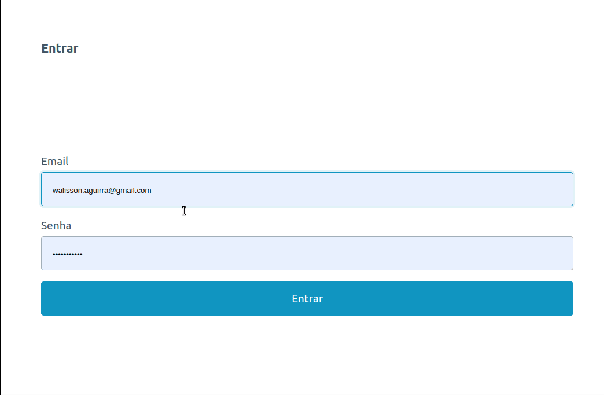
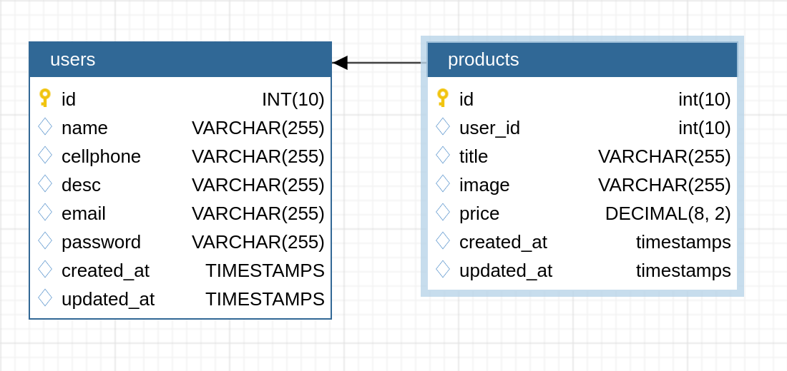

<h1 align="center">🛒 Tiny Marketplace</h1>
<h3 align="center">Mini sistema para venda de produtos usando whatsapp.</h3>



## Sobre o projeto

Este é um sistema de marketplace simples, a ideia é que qualquer pessoa possa ter sua página de venda na internet com zero configuração, você pode anuncia desde livros usado á qualquer tipo de produto e recebe sua solicitação de compra no whatsapp. 

Fique avontade para clonar este repositório e analisa minhas implementação, **É compartilhado conhecimento que se aprende**

<p align="right">(<a href="#readme">volta ao topo</a>)</p>

## Construído com
- Laravel 8
- Pico Framework CSS
- PHP 7.4
- Blade Template
- Laravel Breeze

<p align="right">(<a href="#readme">volta ao topo</a>)</p>


## Guia de instalação
1. Para começar você pode clonar esta projeto na sua máquina local usando o comando abaixo
```sh
git clone https://github.com/walissonaguirra/tiny-marketplace.git
```

2. Este projeto foi contruido com _SQLite 3_, mas você pode muda o isso alterando as configuração no `.env`, [Mais informação](https://laravel.com/docs/8.x/database#introduction)

Crie um arquivo .sqlite local (este sera nosso bando de dados) usando o comando abaixo
```sh
touch database/database.sqlite
```

3. Estamos quase-lá, renomeie o arquivo `.env.example` para `.env`, aqui você pode alterar as variáveis de ambiente

4. Instala as dependências do projeto usando o comando
```sh
composer install
```

5. Executar as migrations para criar bando de dados usando o comando
```sh
php artisan migrate
```

6. Inicie o servido local (Recomendado)
```sh
php artisan serve
```

🎉 **Pronto!!!** você já pode acessar _http://127.0.0.1:8000_ e ver o projeto funcionando

<p align="right">(<a href="#readme">volta ao topo</a>)</p>

## Estrutura de banco de dados

A tabela de usuário tem o relacinamento de `1:N` com a tabela de produtos. Exemplo, um usuário pode ter varias produtos `1:N` e cada produto só pode pertence a um usuário

Caso o usuário decita apagar a sua conta todos os produtos relacionados a ele são apagado junto. este processo e gerenciado pelo proprio bando de dados `onDelete('CASCADE')`

**DER** (Diagrama Entidade-Relacionamento)



<p align="right">(<a href="#readme">volta ao topo</a>)</p>

## License

O Tiny Marketplace é um software de código aberto licenciado sob a [MIT license](https://opensource.org/licenses/MIT).

<p align="right">(<a href="#readme">volta ao topo</a>)</p>

## Contato

<a href="mailto:walisson.aguirra@gmail.com"></a>
<a href="https://wa.me/5594984278097"></a>
<a href="https://www.linkedin.com/in/walissonaguirra"></a>

<p align="right">(<a href="#readme">volta ao topo</a>)</p>
